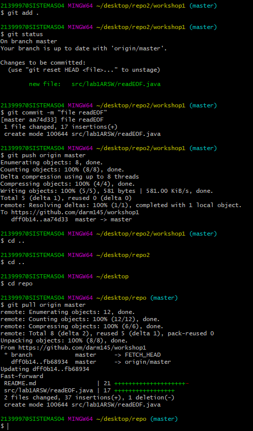

# Workshop 1

## git add .
## What is the purpose of this command?
it is used to apply the changes of the files we are working on and letting them be ready to be commited and applied to the repository 

## git commit -m "Message"
## Answer : Why we used it?

the commit command is used to save the changes that were applied with git add . into the local repository, it is important to commit when we are sure that it is working correctly in order to keep the project working correclty. the message is used to give a short description about what we just do in the project.

## git push origin master
## Answer: What is the purpose of the this command?
git push origin master is used to send the changes made in the local repository to the remote repository,
specifying the branch we are working on, in this case master,this is useful when there are a lot of people working on the project.

## git clone <repository>
## Answer: What is the purpose of this command?
  git clone is used to download a copy of the repository in order to work on it. <repository> is where we put the URL of the repository, also with the repository we can make changes if we are collaborators.
 
## screenshot 

## git pull origin master
## Answer: What that command does?
git pull origin master is usted to download the changes of the remote repository into the local repository and updating the files to the lastest version of the project
